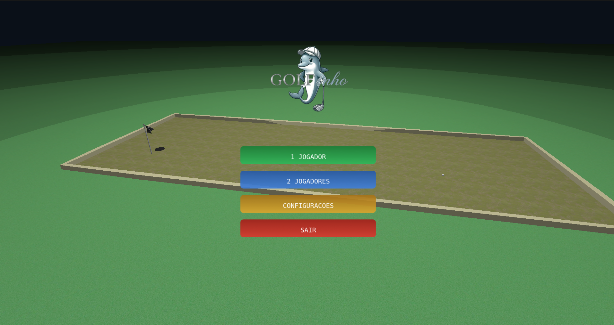
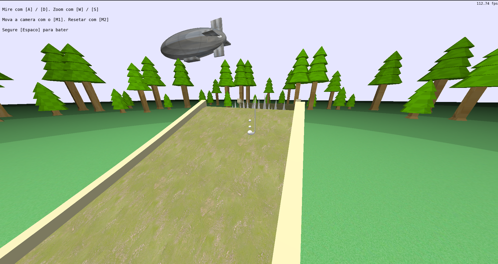

# GOLFinho - Simulador de Minigolfe 3D

## Descrição da Aplicação
A aplicação desenvolvida é um simulador 3D interativo de Minigolfe, implementado utilizando C++ e a biblioteca gráfica OpenGL moderno (Core Profile). O jogo foca em fornecer uma física o mais realista possível e determinística através de detecção de colisões ponto-malha 3D (sphere-mesh). O jogo conta com 5 pistas modeladas no Blender, cada uma com seus obstáculos característicos (incluindo loops verticais, curvas acentuadas, saltos com espinhos e espirais), renderização de cenários temáticos, incluindo um zepelim, cuja movimentação é definida através de uma curva de Bézier cúbica, com mapeamento de texturas, shaders para iluminação básica e um sistema multiplayer local (turnos), bem como animação do swing do taco.

## Contribuições dos Membros
O desenvolvimento do projeto foi dividido de forma colaborativa entre a dupla:
- **Leonardo Dias:** Responsável pela implementação do menu principal e refatoração do código em dado momento (quando sentimos que precisávamos reorganizá-lo para manter o projeto organizado).
- **Gabriel Fauth:** Responsável pela modelagem das pistas, utilizando o Blender.

Além disso, o código em si foi dividido de forma bastante igualitária entre os dois membros, como é possível ver através do histórico de commits do GitHub, tendo a carga de trabalho ao final ficado bem distribuída entre os dois.

## Uso de Ferramentas de Inteligência Artificial
Para o desenvolvimento deste trabalho, fizemos uso de ferramentas de Inteligência Artificial. Utilizamos o Gemini (através da interface Antigravity) como auxiliar direto na escrita e edição de código, o Github Copilot integrado ao VS Code para usar seu auto-complete, e o Claude para tirar dúvidas conceituais sobre computação gráfica e a biblioteca OpenGL. Além disso, as IAs foram utilizadas para ajudar a debugar problemas matemáticos complexos (como o Z-fighting) e para refatorar a arquitetura estrutural do projeto, mantendo os arquivos .cpp e .h limpos e organizados.

**Análise Crítica:** Achamos o uso dessas ferramentas incrivelmente útil para acelerar a refatoração e identificar bugs escondidos no código (ex: erros na física do loop da pista 3). No entanto, a IA falhou em momentos que exigiam intuição espacial e percepção visual direta do cenário 3D. Por exemplo, a IA teve imensa dificuldade em entender as dimensões espaciais das pistas para posicionar corretamente as árvores do cenário e o spawn dos jogadores, exigindo que nós guiássemos fortemente o processo e fizéssemos esses ajustes finos no código.

## Imagens da Aplicação






## Manual de Utilização
O simulador possui controles intuitivos baseados no uso do mouse e teclado:

**No Menu Inicial:**
- **Mouse (Botão Esquerdo):** Clique nas opções da tela para escolher a quantidade de jogadores (Singleplayer ou Multiplayer) e iniciar a partida.
- **ESC:** Fecha o jogo.

**Durante a Partida:**
- **Botão Esquerdo do Mouse (Segurar e Arrastar):** Controla a mira e a força da tacada. Arraste para os lados para mirar, e arraste o mouse para trás/frente para definir a força. Solte o botão para realizar a tacada (swing).
- **C:** Alterna o modo de câmera entre a **Câmera Livre** e a **Câmera Look-At** (que acompanha a bolinha).
- **W, A, S, D:** Movimentam a câmera pelo cenário (apenas no modo Câmera Livre).
- **Shift Esquerdo:** Aumenta a velocidade de movimento da Câmera Livre.
- **Botão Esquerdo do Mouse (Segurar e mover - Câmera Livre):** Rotaciona a visão (Pan/Tilt) da Câmera Livre.
- **M / ESC:** Retorna ao Menu Principal.

## Compilação e Execução
O projeto utiliza o **CMake** como sistema de build. Para compilar e rodar o projeto em um ambiente Linux (ou WSL), abra o terminal no diretório raiz do projeto e siga os seguintes passos:

1. **Configuração do Build:**
   Gere os arquivos de compilação criando o diretório `build`:
   ```bash
   cmake -B build -S .
   ```

2. **Compilação:**
   Compile o código-fonte:
   ```bash
   cmake --build build
   ```

3. **Execução:**
   Após a compilação ser concluída com sucesso, execute o jogo com o comando:
   ```bash
   cmake --build build -- run
   ```
